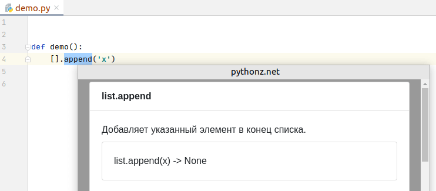

pythonz.net in PyCharm
======================
https://github.com/idlesign/pythonz-pycharm-plugin

Description
-----------

*Plugin for PyCharm featuring code hints from pythonz.net*

Repository link: https://plugins.jetbrains.com/plugin/14132-pythonz

* Install the plugin and restart IDE (search by `pythonz` keyword);
* Select text you want to get hint for or set a caret on it;
* Press ``AltGr + P`` to trigger QR code popup. 
  You may bind a custom keystroke for "Show pythonz.net Code Hints" action in ``Keymap``.

Requirements
------------

* PyCharm 2020.2 using bundled JBRuntime
